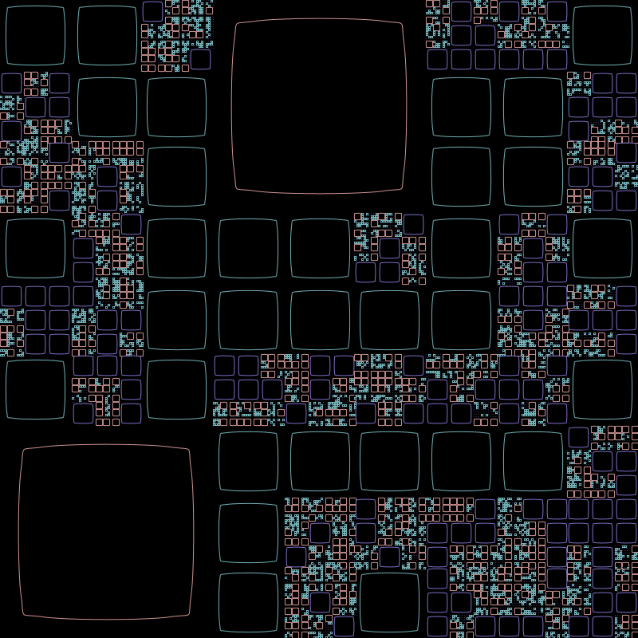

# DoodlePlot

DoodlePlot is a Pen Plotter Design Generator with radiused corners. It allows you to create intricate designs with various parameters and export them as SVG files.

## Key Controls

- **T** or **t**: Toggle the display of the parameters panel.
- **G** or **g**: Generate a new design with random paths.
- **E** or **e**: Export the current design to an SVG file.
- **Arrow Up**: Increase grid size (snapping resolution).
- **Arrow Down**: Decrease grid size (snapping resolution).
- **Arrow Left**: Decrease the number of layers.
- **Arrow Right**: Increase the number of layers.
- **D** or **d**: Decrease plot density.
- **I** or **i**: Increase plot density.
- **L** or **l**: Toggle lead-in lines.
- **[** or **]**: Decrease or increase the direction change frequency.
- **S** or **s**: Toggle snap to 90-degree angles.
- **C** or **c**: Toggle inverted colors.
- **Q** or **q**: Decrease draw point frequency.
- **W** or **w**: Increase draw point frequency.

## Features

- **Grid Size**: Adjust the grid size for snapping resolution.
- **Layers**: Control the number of layers in the design.
- **Plot Density**: Modify the density of the plot.
- **Direction Change Frequency**: Change how often the direction changes.
- **Draw Point Frequency**: Adjust the frequency of draw points.
- **Snap to 90-degree Angles**: Toggle snapping to 90-degree angles.
- **Inverted Colors**: Toggle between normal and inverted colors.
- **Lead-in Lines**: Toggle lead-in lines for the design.

## Installation

1. Download and install [Processing](https://processing.org/download/).
2. Clone or download this repository.
3. Open `build.pde` in Processing.

## Usage

1. Run the sketch in Processing.
2. Use the key controls to adjust parameters and generate designs.
3. Press **E** to export the current design as an SVG file.

## License

This project is licensed under CC BY-NC-SA 4.0 

## Acknowledgements

- [Processing](https://processing.org/) - Software sketchbook and a language for learning how to code within the context of the visual arts.
